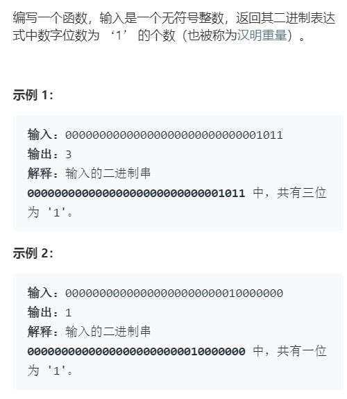

# 常用的位操作

本文分两部分，第一部分列举几个有趣的位操作，第二部分讲解算法中常用的 n & (n - 1) 操作，顺便把用到这个技巧的算法题列出来讲解一下。因为位操作很简单，所以假设读者已经了解与、或、异或这三种基本操作。

位操作（Bit Manipulation）可以玩出很多奇技淫巧，但是这些技巧大部分都过于晦涩，没必要深究，读者只要记住一些有用的操作即可。

### 一、几个有趣的位操作

1. 利用或操作 `|` 和空格将英文字符转换为小写

```c
('a' | ' ') = 'a'
('A' | ' ') = 'a'
```

2. 利用与操作 `&` 和下划线将英文字符转换为大写

```c
('b' & '_') = 'B'
('B' & '_') = 'B'
```

3. 利用异或操作 `^` 和空格进行英文字符大小写互换

```c
('d' ^ ' ') = 'D'
('D' ^ ' ') = 'd'
```

PS：以上操作能够产生奇特效果的原因在于 ASCII 编码。字符其实就是数字，恰巧这些字符对应的数字通过位运算就能得到正确的结果，有兴趣的读者可以查 ASCII 码表自己算算，本文就不展开讲了。

4. 判断两个数是否异号

```c
int x = -1, y = 2;
bool f = ((x ^ y) < 0); // true

int x = 3, y = 2;
bool f = ((x ^ y) < 0); // false
```

PS：这个技巧还是很实用的，利用的是补码编码的符号位。如果不用位运算来判断是否异号，需要使用 if else 分支，还挺麻烦的。读者可能想利用乘积或者商来判断两个数是否异号，但是这种处理方式可能造成溢出，从而出现错误。（关于补码编码和溢出，参见前文）

5. 交换两个数

```c
int a = 1, b = 2;
a ^= b;
b ^= a;
a ^= b;
// 现在 a = 2, b = 1
```

6. 加一

```c
int n = 1;
n = -~n;
// 现在 n = 2
```

7. 减一

```c
int n = 2;
n = ~-n;
// 现在 n = 1
```

PS：上面这三个操作就纯属装逼用的，没啥实际用处，大家了解了解乐呵一下就行。

### 二、算法常用操作 n&(n-1)

这个操作是算法中常见的，作用是消除数字 n 的二进制表示中的最后一个 1。

看个图就很容易理解了：


1. 计算汉明权重（Hamming Weight）



就是让你返回 n 的二进制表示中有几个 1。因为 n & (n - 1) 可以消除最后一个 1，所以可以用一个循环不停地消除 1 同时计数，直到 n 变成 0 为止。

```cpp
int hammingWeight(uint32_t n) {
    int res = 0;
    while (n != 0) {
        n = n & (n - 1);
        res++;
    }
    return res;
}
```

1. 判断一个数是不是 2 的指数

一个数如果是 2 的指数，那么它的二进制表示一定只含有一个 1：

```cpp
2^0 = 1 = 0b0001
2^1 = 2 = 0b0010
2^2 = 4 = 0b0100
```

如果使用位运算技巧就很简单了（注意运算符优先级，括号不可以省略）：

```cpp
bool isPowerOfTwo(int n) {
    if (n <= 0) return false;
    return (n & (n - 1)) == 0;
}
```

以上便是一些有趣/常用的位操作。其实位操作的技巧很多，有一个叫做 Bit Twiddling Hacks 的外国网站收集了几乎所有位操作的黑科技玩法，感兴趣的读者可以点击「阅读原文」按钮查看。

坚持原创高质量文章，致力于把算法问题讲清楚，欢迎关注我的公众号 labuladong 获取最新文章：


[上一篇：twoSum问题的核心思想](twoSum问题的核心思想.md)

[下一篇：拆解复杂问题：实现计算器](../数据结构系列/实现计算器.md)

[目录](../README.md#目录)